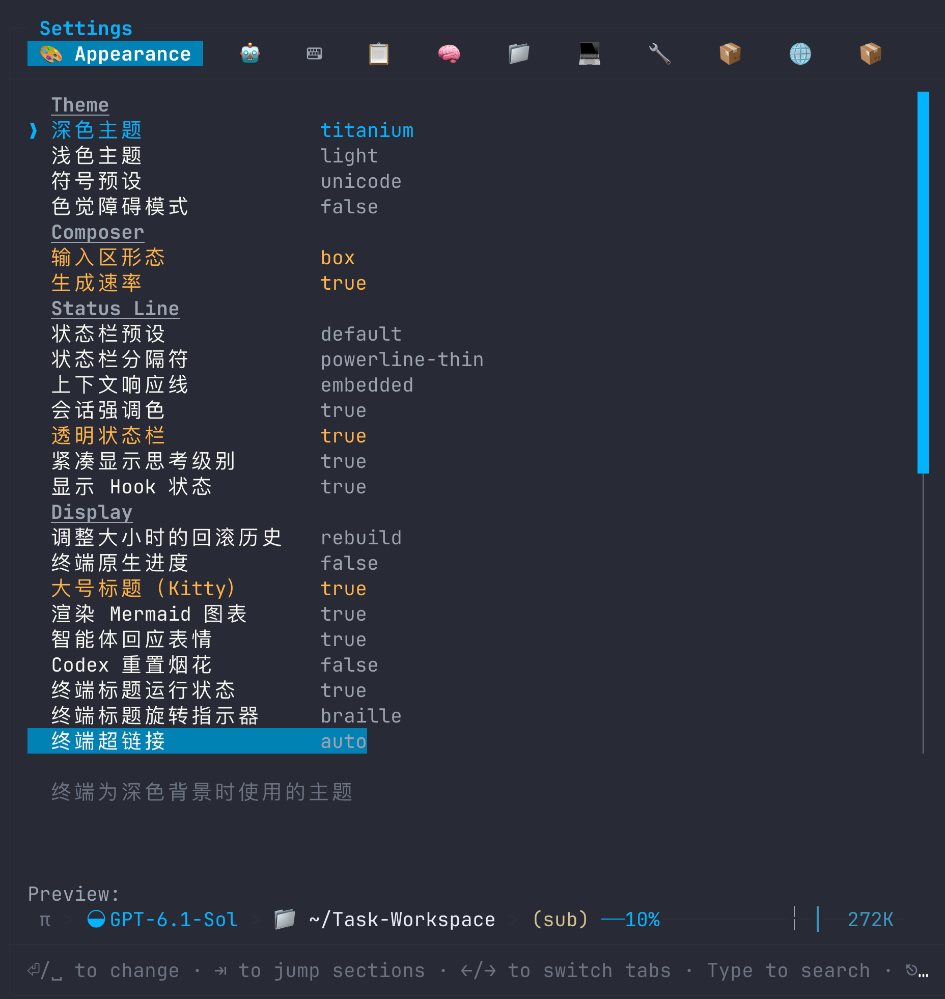
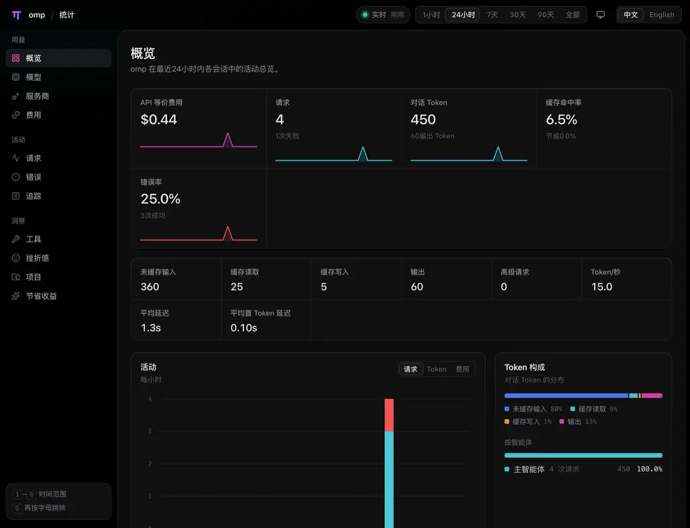

# omp-settings-zh

让官方 [Oh My Pi（OMP）](https://github.com/can1357/oh-my-pi) 的原生 `/settings` 和内置斜杠命令补全说明显示简体中文，并让直接运行 `omp stats` 打开的网页支持中文 / English。设置与补全使用 Extension；Stats 使用可撤销的本地 PATH 启动器，仍运行实际安装的官方 CLI。不分叉、不替换官方二进制，不改变设置、命令执行与统计计算。

## 界面预览

### 原生设置面板

设置名称与说明显示中文；官方页签、分组、控件和设置值保持不变。



### Stats 网页

直接运行 `omp stats`，在原服务地址使用中文 / English 切换。截图中的“API 等价费用”是估算，不是实际账单。



## 当前版本

- 当前版本：`18.19.0`，对应官方 OMP 18.19.0。是否正式发布以 [GitHub Releases](https://github.com/rockythink/omp-settings-zh/releases) 为准，main、源码编号和本机升级不等于 Release
- 目标官方宿主：OMP18.19.0，SHA-256匹配官方darwin-arm64资产；内嵌及最低外部Bun1.4.4。已有Agent/Stats进程不热加载新代码，须重启
- Settings：456项UI；新增`task.autoParallel`（自动并行）、`task.steps`（顺序任务步骤）、`browser.webkit`、`browser.webkitPath`四项译文，官方删除`task.file`后移除其译文，复核`ask.timeout`与5项浏览器设置的原文变化，其余446项不重译。功能默认值与执行逻辑由官方负责
- 设置汉化：离线，无网络请求和遥测；不读取当前设置值或凭据，不写`config.yml`；选项显示副本与`/effort`参数原文隔离
- Commands：89定义、98标识、9别名、27动态回调；相对18.18.8注册表、动态回调与补全接口均无变化（官方仅移除`/mcp`的Smithery子命令，子命令说明本就不译）。参数、第三方说明、模型/提供商ID和effort值不译，不改变匹配/排序/插入/执行
- 验收范围：macOS普通终端＋系统浏览器的真实官方compiled；Settings、Commands、Stats分项证据见CONTEXT。Tern路径未验证、不宣称支持；Windows不纳入
- Stats：实际运行官方18.19.0编译CLI，不以固定npm包替代。Spotlight“额外开销”卡新增的“失败原因”列、已知原因标签（未登录/超时/网络/速率受限/无效响应/未记录）、`N 条结果`提示与Stencil未登录提示已翻译；`HTTP <状态码>`、未知原因代码、百分比、`/login`与`STENCIL_API_KEY`保持原样。未知文案、数值、请求/会话正文、错误原文及canvas文字保留。少量混合数据的提示（如`Most used: <工具>`、`52.9% of requests · <服务商>`）保留英文
- 18.18.8修复（沿用）：官方后台自动更新（`update.auto`）只替换官方二进制，不再覆盖Stats启动器；本机官方worker已把18.18.9→18.19.0装到官方原位置，启动器保持不变
- 18.6.5：Settings 选项与命令参数原文隔离，修复 `/effort` 参数说明泄漏；`omp update` 透传前恢复官方目录优先，避免上游更新覆盖 PATH 启动器。Stats 18.6.1 客户端与 18.6.0 无变化，既有译文和边界保持
- 18.6.6：保留 `/effort` 的 `off` 等官方级别字面量；Errors 页错误特征筛选器的正文与 tooltip 均保持原始错误数据，不与 UI 词典混淆

## 兼容范围与限制

| 插件 | 已验证 OMP | 声明的宿主范围 |
|---|---|---|
| 0.2.0 | 18.4.4 | >=18.4.4 <19 |
| 18.4.6 | 18.4.6 | >=18.4.6 <19 |
| 18.5.0 | 18.5.0 | >=18.5.0 <19 |
| 18.5.1 | 18.5.1 | >=18.5.1 <19 |
| 18.6.0 | 18.6.0 | >=18.6.0 <19 |
| 18.6.1 | 18.6.0 | >=18.6.0 <19 |
| 18.6.2 | 18.6.0 | >=18.6.0 <19 |
| 18.6.3 | 18.6.0 | >=18.6.0 <19 |
| 18.6.4 | 18.6.0 | >=18.6.0 <19 |
| 18.6.5 | 18.6.1 | >=18.6.1 <19 |
| 18.6.6 | 18.6.1 | >=18.6.1 <19 |
| 18.6.7 | 18.6.3 | >=18.6.3 <19 |
| 18.8.0 | 18.8.0 | >=18.8.0 <19 |
| 18.8.4 | 18.8.4 | >=18.8.4 <19 |
| 18.8.8 | 18.8.8 | >=18.8.8 <19 |
| 18.9.1 | 18.9.1 | >=18.9.1 <19 |
| 18.10.2 | 18.10.2 | >=18.10.2 <19 |
| 18.10.3 | 18.10.3 | >=18.10.3 <19 |
| 18.11.1 | 18.11.1 | >=18.11.1 <19 |
| 18.11.3（历史未发布候选） | 18.11.3（macOS 编译版；资源门禁未通过） | >=18.11.3 <19 |
| 18.12.1 | 18.12.1（macOS/Linux 编译版；默认opener验收例外见上文） | >=18.12.1 <19 |
| 18.12.2（未发布候选） | 18.12.2（本机 macOS 编译版；默认 opener 门禁受阻） | >=18.12.2 <19 |
| 18.12.3（未发布候选） | 18.12.3（本机 macOS 编译版；默认 opener 门禁受阻，分项证据见 CONTEXT） | >=18.12.3 <19 |
| 18.12.5（未发布候选） | 18.12.5（本机 macOS 编译版；默认 opener 实时确认阻塞，完整门禁未通过） | >=18.12.5 <19 |
| 18.12.6 | 18.12.6（macOS 编译版及 macOS/Linux CI；真实默认 opener 补验通过） | >=18.12.6 <19 |
| 18.13.1（未发布候选） | 18.13.1（本机 macOS 编译版；完整验收状态见 CONTEXT） | >=18.13.1 <19 |
| 18.13.3（未发布候选） | 18.13.3（本机 macOS 编译版；默认 opener 实时确认阻塞，分项证据见 CONTEXT） | >=18.13.3 <19 |
| 18.14.0（未发布候选） | 18.14.0（本机 macOS 编译版；默认 opener 与官方冷摄取门禁未过，分项证据见 CONTEXT） | >=18.14.0 <19 |
| 18.14.1（未发布候选） | 18.14.1（本机 macOS 编译版；完整验收及精确提交 CI 另核，Stats 门禁未过） | >=18.14.1 <19 |
| 18.15.0（历史未发布候选） | 18.15.0（非Tern路径分项见CONTEXT；该制品冷摄取未修） | >=18.15.0 <19 |
| 18.16.0（历史未发布候选） | 18.16.0（官方冷摄取修复已实际验证；资源与最终矩阵未过，见CONTEXT） | >=18.16.0 <19 |
| 18.17.0（历史未发布候选） | 18.17.0（定向适配；未完成compiled/网页完整门禁） | >=18.17.0 <19 |
| 18.18.6 | 18.18.6（macOS 编译版三面真实验收；Tern 未验证） | >=18.18.6 <19 |
| 18.18.8 | 18.18.8（macOS 编译版三面真实验收；Tern 未验证） | >=18.18.8 <19 |
| 18.19.0 | 18.19.0（macOS 编译版三面真实验收；发布判定以 GitHub Release 为准，Tern 未验证） | >=18.19.0 <19 |

声明范围不等于所有版本都经过验证。内部模块或元数据结构不兼容时，插件报告兼容性错误，不冒险继续覆盖。

从 18.4.6 起，宿主适配发布以目标 OMP 稳定版编号为基线；同一宿主基线上的独立功能或修复递增插件补丁号，不代表上游出现同号版本。已用编号不复用，实际宿主以兼容表为准。上游无设置变更时复用已有译文，但仍验证接口、完整检查和实际编译版；变化需先补译或复核，检查失败不发布。历史版本和标签不覆盖。

**设置面板保留官方页签、分组标题、面板标题和操作提示。** 设置汉化不修改分组标识、排序或面板实现。从磁盘导入 UI 副本不能证明已修改编译宿主的共享对象；18.4.4 适配时已实测发现这种差异。

Advisor、Prewalk、Mnemopi、Snapcompact、Archive、MCP、LSP、API、eval、工具名、模型名和提供商名等保留更清楚的英文形式。Archive 指 Agent 在 eval 中浏览提示词历史、项目、会话和回顾的只读能力，不是压缩包或归档操作。动态快捷键说明沿用宿主 getter 的实际键位图标；切回原版会恢复原始属性描述符。

## 安装

当前版本要求官方OMP `>=18.19.0 <19`及外部Bun `>=1.4.4`。各版本实际验证基线见上表，是否正式发布以GitHub Release为准。发布主线仅macOS/Linux。Windows PR #1现场仍CLOSED、isDraft:true、mergedAt:null，草稿由非发布tag [`archive/windows-support-20261018`](https://github.com/rockythink/omp-settings-zh/tree/archive/windows-support-20261018)保留，不宣称正式支持；本地与远端仅维护main工作分支。通过官方插件管理器安装：

```sh
omp plugin install github:rockythink/omp-settings-zh
```

安装后重新启动 OMP，然后照常输入 `/settings`。启动默认应用中文，正常应用时保持安静。

Stats 翻译随插件默认安装，不需要另行启用，也没有独立启用命令。正常 GitHub/npm 安装验证时自动生成可撤销 PATH 启动器；重新打开终端即可直接运行 `omp stats`。本地 link 的首次扩展加载同样自动安装。要求 macOS/Linux、zsh 或 Bash，且 Bun 符合项目 engines；GUI 启动缺少 `SHELL` 时读取实际账户的登录 shell，不猜测默认值。macOS 下 Bun 缺少账户环境名时按真实 UID 解析，不把 `unknown` 当作当前账户。

`command -v omp` 应指向 `~/.local/share/omp-settings-zh/bin/omp`；原官方可执行文件不变。安装器只维护自己的 PATH 块，重复加载幂等，不覆盖其他工具的同名文件。已有终端不会继承子进程修改的 PATH，因此需要新终端，但不需要 Stats 开关或安装命令。

## 运行中切换语言

```text
/settings-language       # 打开原版 / 简体中文选择器
/settings-language zh    # 挂载中文显示元数据
/settings-language en    # 撤销汉化，恢复宿主原始文案
```

无需重启；切换后重新打开 `/settings` 或补全列表即可。这两个模式影响设置和内置命令补全文案，不控制模型回复语言。选择保留在当前进程内，下次启动默认中文，不写入用户配置。

这里的热插拔指**汉化效果即时挂载和撤销**。OMP 的原生插件安装、禁用、卸载和 `/reload-plugins` 生命周期不由本插件改写；在当前 OMP 中不能把禁用或 `/reload-plugins` 当作已加载 Extension 的即时卸载。想立即恢复原版，先执行 `/settings-language en`，再按需禁用或卸载插件。

## Stats 网页语言切换

```sh
omp stats                 # 官方统计服务 + 默认中文的网页
omp stats --json          # 官方原始 JSON，直接透传
omp stats --summary       # 官方终端摘要，直接透传
```

网页顶部提供 **中文 / English** 按钮，切换即时生效。首次默认中文，选择保存在该网页 origin 的 localStorage 中，刷新与路由切换保留；同 host/port 重启也保留，换地址则使用该地址自己的偏好。网页语言与 `/settings-language` 相互独立。

启动器保留原始 argv、cwd、Profile、stdio 与官方 CLI 的独立评估上下文；非 Stats、JSON、摘要和帮助直接执行原 OMP。Web 模式先构建本地翻译脚本，通过 `BUN_OPTIONS --preload` 包装该子进程的 `Bun.serve` 页面响应：仅在官方 Stats HTML 注入同源脚本，在同一个监听器提供 JS，API 与 SSE 保持原处理器。**只有原官方 Stats 服务，原 `--port` / `-p`、`--host`、打开策略和 URL 均由宿主决定**；默认地址 `http://127.0.0.1:3847` 直接显示语言按钮，不输出第二个代理地址。现有 `BUN_OPTIONS` 保留。

18.15.0 官方 CLI 优先通过 `TERN_PANE_SOCKET` / `TERN_PANE` 打开 Tern `over` 页面，否则回退原系统 opener；`BROWSER` 或测试 opener bridge 不能拦截 Tern 路径。源码中只有可关闭的 Tern CLI 页面才提供 Close/关闭与 Esc，通过原 `/api/close` 退出；系统浏览器回退时按钮隐藏。官方信号合同改为 SIGINT=130、SIGTERM=143、SIGHUP=129，关闭页面/API 的正常退出为 0；Tern 页面实际回收仍未验，不能仅凭进程/私有目录消失宣称成功。

本次正式验收范围为 macOS/Linux 普通终端＋系统浏览器。Tern 不是插件依赖，缺少它不阻止该范围发版；保留上述官方路径，但 Tern 未经独立验证，不宣称支持。以后明确纳入时再验证真实 pane/block 生命周期，不用系统浏览器代证。

会话里的 `/stats` 不被接管，仍为官方入口：18.15.0 优先 Tern `beside`，成功后断开客户端而不套用 CLI `over` 的关闭生命周期，失败才用系统 opener。与终端 `omp stats` 使用相同 Profile / Agent 数据目录时，两者都汇总该目录内的多个项目与会话，不是全局与单会话的区别；`/stats` 的付费评估绑定当前会话，而 CLI 使用独立上下文。`/trace` 是当前会话的追踪深链接，沿用会话打开策略。

译文仅覆盖已识别的界面标题、导航、说明、控件、空态和显示属性。模型、提供商、工具与项目名称、路径、请求和会话正文、原始错误、统计数值及 API 返回内容保留原文；未知文案与 canvas 文字也保留原文，不宣称完整 Web 汉化。Frustration 的评估和费用确认继续使用官方流程，语言按钮不会发起评估。

这是 Bun 启动期 Hook，而非 OMP 正式 Locale 接口；只对新启动的 CLI 生效，不热注入已运行的服务。OMP/Bun 升级必须重新验证真实编译版。浏览器未能自动打开时使用原 CLI 输出的 URL；绝对路径执行原 OMP 会绕过启动器，保持原版行为。

## 管理

```sh
omp plugin list --json
omp plugin doctor omp-settings-zh --json
omp plugin upgrade omp-settings-zh
omp plugin disable omp-settings-zh
omp plugin enable omp-settings-zh
omp plugin uninstall omp-settings-zh
```

升级、启用或禁用后重新启动 OMP，以加载新的 Extension 状态。`/settings-language` 控制设置与内置命令补全文案；Stats 默认中文，只在网页内切换中文 / English，没有独立命令开关。禁用 Extension 不撤销已有 CLI 启动器。通过前置 PATH 的正常 `omp plugin uninstall omp-settings-zh` 卸载时，先预检受管文件，官方卸载成功后自动清理启动器和 PATH 块；`--dry-run` 不清理。撤销仅影响本插件创建的内容，不迁移用户设置。

当前 OMP 支持按插件名更新 GitHub/npm 安装的插件：`omp plugin upgrade omp-settings-zh`。GitHub 插件重新解析安装时记录的分支或标签；固定标签不会自动跳到新标签。也可以使用 `omp plugin install github:rockythink/omp-settings-zh --force` 重新安装仓库默认分支。npm 插件更新到最新发布版本，本地 link 插件直接使用源目录文件，无需 upgrade。

`omp plugin upgrade`不带插件名时仅更新marketplace插件，不遍历GitHub/npm插件。18.17.0的marketplace升级支持`--dry-run`，但GitHub/npm包升级仍拒绝该标志；预览本插件重新安装应使用`omp plugin install github:rockythink/omp-settings-zh --force --dry-run`。

## 开发与验证

```sh
bun install --frozen-lockfile
bun run check
omp plugin link . --scope project
```

- `bun test`：设置可逆性与原生面板契约；单服务预加载的服务隔离、原授权/错误状态、SSE 流式与启动器安装/卸载边界。
- `bun run typecheck`：TypeScript 类型检查。
- `bun run coverage:check`：设置项翻译完整性。
- `bun run drift:check`：设置路径、选项值和英文原文哈希漂移。
- `bun run commands:check`：全量内置命令覆盖、新增/删除、原文、别名及标识冲突门禁；已纳入 `bun run check`。复用运行时的原文匹配规则，仅允许已知动态快捷键占位变化。
- `bun run smoke`：真实宿主元数据的三轮应用/撤销、原生面板派生、行为元数据不变和零网络请求检查。
- 实际编译版与干净 GitHub 安装复用 `scripts/smoke-cli.ts`：传入真实官方 OMP 和 Chrome 的绝对路径；`OMP_SMOKE_GITHUB_REF=<40位提交SHA>`选择该精确提交的干净 GitHub 安装，未提供则验证本地 link。每次先证明正常/人为失败回收，再执行探针；树外资源账本在运行结束后保留。测试专属 opener 仍不代替系统默认 opener 或 Tern 真实验收。

面板或宿主适配变化还必须在**实际使用的官方编译版**中验证加载、中文搜索、设置编辑和同进程语言切换。源码模式通过不代表编译版共享对象可用。
命令补全适配须另在真实编译版验证 `/` 列表、别名、动态状态/键位、中英文往返及 Tab/Enter 插入和执行。静态命令门禁只检查锁定开发依赖，不代替升级后的宿主注册表、动态模板源码审查或实际 UI 验证。Stats 也需独立完成实际官方 CLI 与浏览器验证。

## 翻译贡献

翻译按完整 setting path 和 option value 绑定，禁止按英文字符串全局替换；活动译文仅依据目标 OMP 的官方英文元数据独立生成与复核。

详见 [项目上下文](CONTEXT.md)、[产品需求](docs/PRD.md)、[技术设计](docs/TECHNICAL-DESIGN.md)、[翻译规范](docs/TRANSLATION-GUIDE.md)、[贡献指南](CONTRIBUTING.md) 和 [第三方声明](THIRD_PARTY_NOTICES.md)。

## 与上游的关系

本项目不是 Oh My Pi 官方项目。OMP 名称、源码和产品归其原作者及贡献者所有。本项目提供独立的简体中文设置显示元数据与 Stats 网页显示适配。

## License

[MIT](LICENSE)
